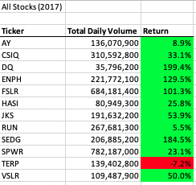
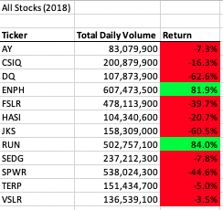
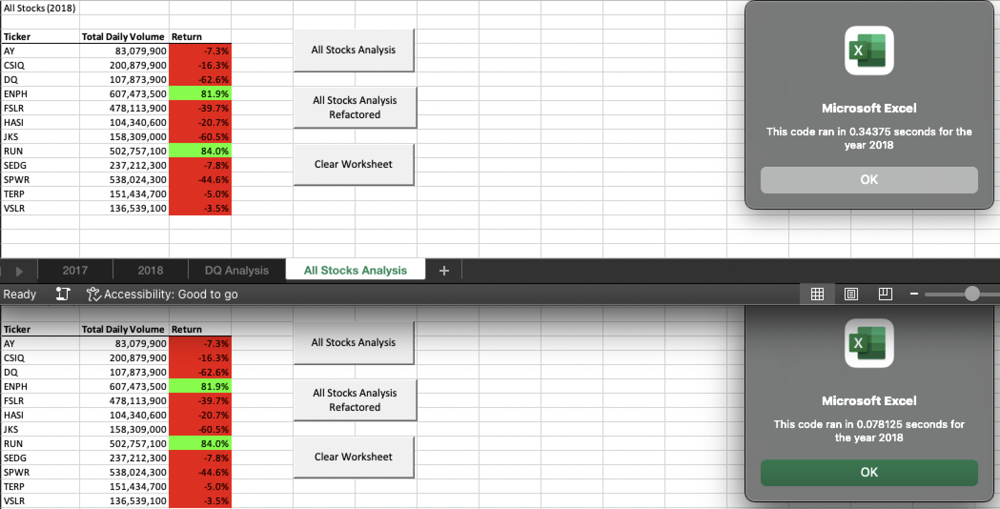

# VBA of Wall Street Analysis

## Overview
The purpose of this analysis is to analyze the performance of several green energy stocks for Steve's parents. Specifically, total daily volume and percent return were utilized as performance metrics. 

## Results
Steve's parents were initially interested in purchasing stocks in a green energy company, DAQO. This stock's total daily volume was in the bottom quartile of the twelve stocks investigated in this analysis for both 2017 and 2018. And despite having nearly 200% return in 2017, DAQO stocks plummeted to the bottom of the list with -62.6% return in 2018. This shows DAQO stock is volatile year-to-year, and Steve's parents would be taking on a lot of risk by investing a large proportion of their savings in this stock.

This analysis also revealed that 2017 appeared to be a bull market, with 11 out of 12 stocks yielding a positive return. But this changed in 2018, with only 2 out of 12 stocks (ENPH and RUN) yielding a positive return. These stocks are also in the top quartile of total daily volume in 2018. That said, the two top-traded stocks in 2017 (FSLR and SPWR) both yielded approximately -40% return in 2018, suggesting daily trading volume is not a reliable metric for success in making long-term investments.
 
 

 
*Analysis of 2017 green energy stocks*  
 

 
*Analysis of 2018 green energy stocks*  
 

Steve's parents would be wise to take their son's advice and focus on building a diversified portfolio, especially as they are nearing retirement age. If they were interested in investing a small proportion of their savings in green energy stocks, they may consider researching ENPH and RUN stocks further, since both fared well in both the bear market of 2018.

While this subroutine was helpful for Steve to analyze a small number of stocks for his parents, it could also be used by mutliple analysts to analyze much larger datasets with some modification to populate the tickers array. In a high-volume setting, the refactored code would be a better choice, as the refactored code performed 4.4 times faster (0.078125 seconds vs 0.34375 seconds)original code.
 
 

 
*Runtime comparison of original and refactored code to produce 2018 analysis*  
 

## Summary

In summary, this analysis was illuminating on the state of the green energy markets in 2017 and 2018 and will help Steve guide his parents in their investment choices. They will likely want to investigate more stocks after seeing the results. 

The original code produced in the module is inefficent as it loops through all the data each time the ticker changes, while the refactored code is able to only loop the entire dataset once. As a result, the refactored code ran 4.4 times faster than the 
As the number of tickers in the dataset increases, the difference in computing time would likely be amplified. With some small modifications, Steve and potentially other financial analysts could use this code to routinely analyze hundreds or even thousands of stocks. In this case, the refactored code would save both time and computing power.

In general, if code is going to be used often and for a high volume of data then refactoring has the advantage of saving both time and computing power. However, refactoring can also have unintended consequences like introducing a bug in the code. Also, if the code will not be used in a high-volume setting then time spent refactoring may vastly outweigh the runtime saved.

